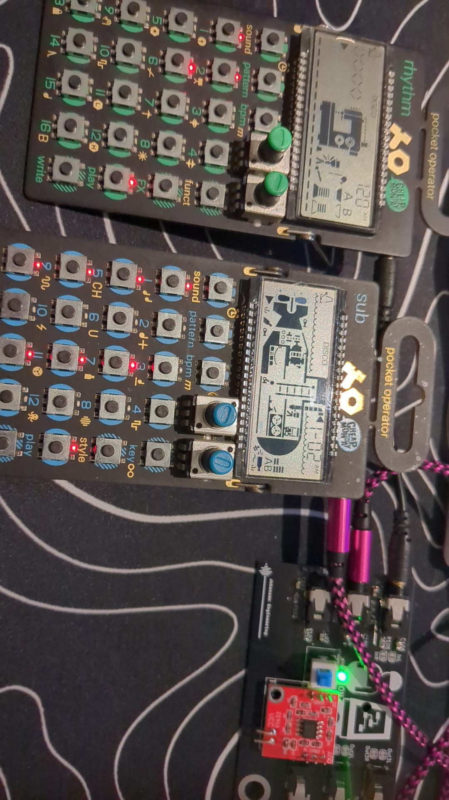

# KicadJE_PocketOperator_TDA1308Amp
TDA1308 based headphone power amp for Teenage Engineering PO series

# Version - REV A1

# Kicad 9

# Purpose AMP
- Amp and sync dist for PO TE boards
- Overcome the drop in audio level that happens when daisychaining the devices
- 
# Operation
## Amp 1
- 2 stereo in
- 1 mono / sync in
- 2 sync out
- 1 stereo headphone out
- power button

# Pictures

Components:
https://www.aliexpress.com/item/1005007083484555.html
